# Домашняя работа 4: Логический уровень PostgreSQL

## Выполнение

Задание выполнялось в операционной системе **Microsoft Windows 11**

* Запущен **Docker Desktop**
* В дирректории G:\otus был сохранён файл docker-compose.yaml

```yaml
version: '3.1'

volumes:
  pg_project:

services:
  pg_db:
    image: postgres:14
    restart: always
    environment:
      - POSTGRES_PASSWORD=postgres
      - POSTGRES_USER=postgres
      - POSTGRES_DB=stage
    volumes:
      - pg_project:/var/lib/postgresql/data
    ports:
      - ${POSTGRES_PORT:-5433}:5432
```

* Через cmd в этой дирректории была выполнена команда *docker-compose up*

*Результат выполнения docker compose up:*
```console
PS G:\otus> docker compose up
[+] Running 2/0
 ✔ Network otus_default    Created                                                                                                                                             0.0s
 ✔ Container otus-pg_db-1  Created                                                                                                                                             0.1s
Attaching to pg_db-1
pg_db-1  |
pg_db-1  | PostgreSQL Database directory appears to contain a database; Skipping initialization
pg_db-1  |
pg_db-1  | 2024-02-23 18:37:24.400 UTC [1] LOG:  starting PostgreSQL 14.11 (Debian 14.11-1.pgdg120+2) on x86_64-pc-linux-gnu, compiled by gcc (Debian 12.2.0-14) 12.2.0, 64-bit
pg_db-1  | 2024-02-23 18:37:24.400 UTC [1] LOG:  listening on IPv4 address "0.0.0.0", port 5432
pg_db-1  | 2024-02-23 18:37:24.400 UTC [1] LOG:  listening on IPv6 address "::", port 5432
pg_db-1  | 2024-02-23 18:37:24.404 UTC [1] LOG:  listening on Unix socket "/var/run/postgresql/.s.PGSQL.5432"
pg_db-1  | 2024-02-23 18:37:24.410 UTC [27] LOG:  database system was shut down at 2024-02-23 18:37:05 UTC
pg_db-1  | 2024-02-23 18:37:24.416 UTC [1] LOG:  database system is ready to accept connections
```

* Было осуществено подключение в базе данных через **DBeaver**:
    * Хост: localhost
    * Порт: 5433
    * База данных: postgres
    * Пользователь: postgres
    * Пароль: postgres

    *Подключение к базе данных:*

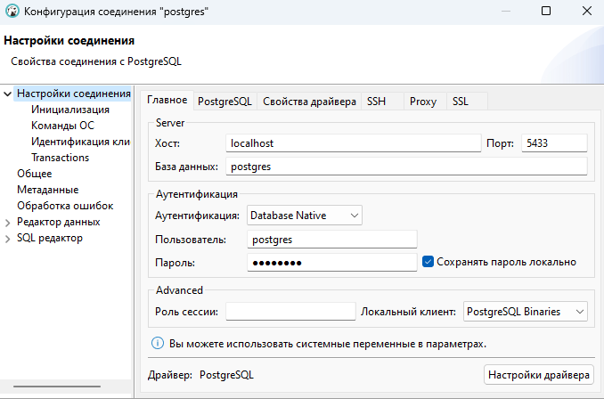

* Была создана новая база данных **testdb**. В этой базе данных была создана новая схема **testnm**, в которой была создана таблица **t1**. В таблицу была вставлена одна строка.

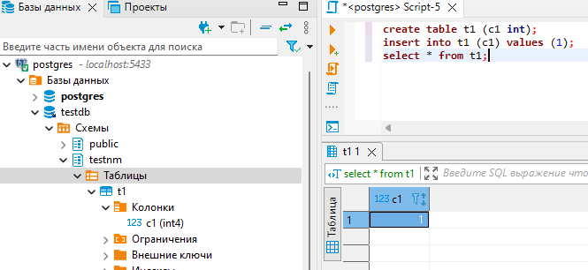

* Роли readonly дал права на базу данных соединение с **testdb**, использование схемы **testnm**, выполнение *SELECT* для всех таблиц в схеме **testnm**

```sql
grant connect on database testdb to readonly;
grant usage on schema testnm to readonly;
grant select on all tables in schema testnm to readonly;
```

* Проверим права пользователя

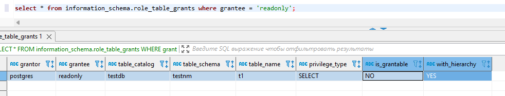

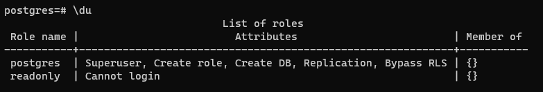

* Создаём пользователя **testread** с паролем **test123**

```sql
create user testread with password 'test123';
```

Проверяем, что пользователь пользователь есть

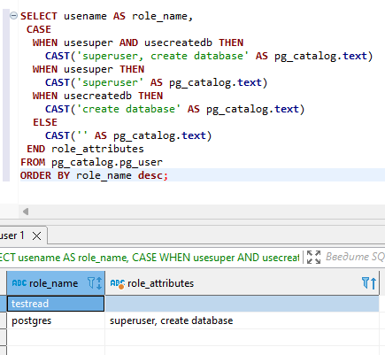

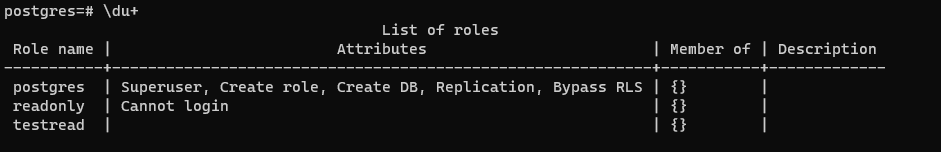

* Назначаем роль **readonly** пользователю **testread**

```sql
grant readonly to testread;
```

Проверяем назначение роли.

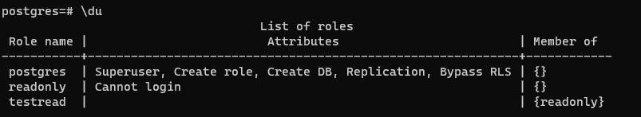

Роль назначилась

* *зайдите под пользователем testread в базу данных testdb*

Захожу под пользователем testread

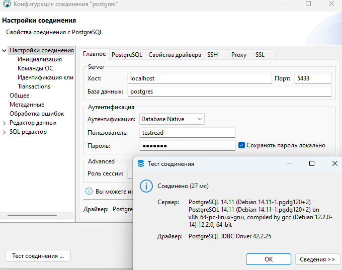

Выполнил:

```sql
select * from t1;
```

Результат:

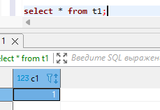

Это произошло из-за того, что таблица t1 создалась в схеме testnm, а не в public

* Пересоздал таблицу t1

```sql
select * from testnm.t1;
create table testnm.t1 (c1 int);
```

* Перезашёл под пользователем testread, сделал *SELECT* и получил ошибку

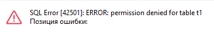

Это произошло потому что права были выданы на уже удалённую таблицу (понял из шпаргалки)

* Перезашёл под пользователем postgres и занова выдал права на роль **readonly**

```sql
grant select on all tables in schema testnm to readonly;
```

* Перезашёл под ролью **testread** и сделал *SELECT*. Получилось.

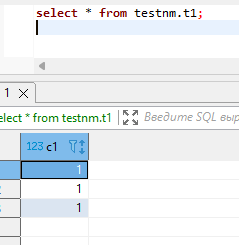

Чтобы это не повторялось, надо выполнить (нашёл в интернете)

```sql
alter default privileges in schema testnm grant all on tables to readonly;
```

* Выполнил команду 

```sql
create table t2(c1 integer);
insert into t2 values (2);
```

Таблица создалась

* Выполнил команды (по шпаргалке) от пользователя postgres

```sql
REVOKE CREATE on SCHEMA public FROM public; 
REVOKE ALL on DATABASE testdb FROM public;
```

* Перезашёл под пользователем testread, попытался выполнить команды

```sql
create table t3(c1 integer);
insert into t2 values (2);
```

Получил ошибку

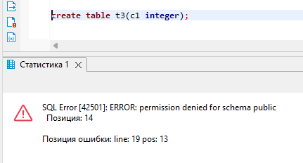