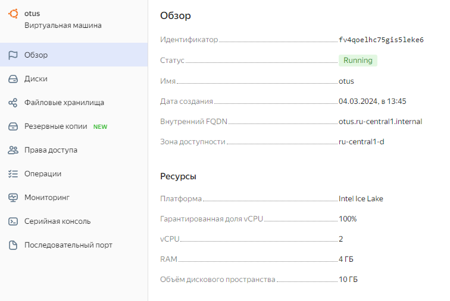

# Домашняя работа: Физический уровень PostgreSQL
## Выполнение

1. *Создать инстанс ВМ с 2 ядрами и 4 Гб ОЗУ и SSD 10GB*



Виртуальная машина создана

2. *Установить на него PostgreSQL 15 с дефолтными настройками*

```console
otus@otus:~$ sudo apt install postgresql
otus@otus:~$ sudo pg_lsclusters
Ver Cluster Port Status Owner    Data directory              Log file
15  main    5433 online postgres /var/lib/postgresql/15/main /var/log/postgresql/postgresql-15-main.log
```

Команды обновления с 14 до 15-ой версии опустил.

3. *Создать БД для тестов: выполнить pgbench -i postgres*


```console
otus@otus:~$ sudo -u postgres psql -p 5433
could not change directory to "/home/otus": Permission denied
psql (15.6 (Ubuntu 15.6-1.pgdg22.04+1))
Type "help" for help.

postgres=# create database otus;
CREATE DATABASE

otus@otus:~$ pgbench -i postgres -U postgres
Password:
dropping old tables...
NOTICE:  table "pgbench_accounts" does not exist, skipping
NOTICE:  table "pgbench_branches" does not exist, skipping
NOTICE:  table "pgbench_history" does not exist, skipping
NOTICE:  table "pgbench_tellers" does not exist, skipping
creating tables...
generating data (client-side)...
100000 of 100000 tuples (100%) done (elapsed 0.07 s, remaining 0.00 s)
vacuuming...
creating primary keys...
done in 1.20 s (drop tables 0.00 s, create tables 0.01 s, client-side generate 0.88 s, vacuum 0.04 s, primary keys 0.28 s).
```

4. *Запустить pgbench -c8 -P 6 -T 60 -U postgres postgres*

```console
otus@otus:~$ pgbench -c8 -P 6 -T 60 -U postgres postgres
Password:
pgbench (15.6 (Ubuntu 15.6-1.pgdg22.04+1))
starting vacuum...end.
progress: 6.0 s, 889.0 tps, lat 8.887 ms stddev 5.822, 0 failed
progress: 12.0 s, 773.5 tps, lat 10.338 ms stddev 6.431, 0 failed
progress: 18.0 s, 717.7 tps, lat 11.149 ms stddev 11.225, 0 failed
progress: 24.0 s, 773.8 tps, lat 10.341 ms stddev 6.338, 0 failed
progress: 30.0 s, 633.8 tps, lat 12.617 ms stddev 50.262, 0 failed
progress: 36.0 s, 756.0 tps, lat 10.582 ms stddev 8.122, 0 failed
progress: 42.0 s, 774.0 tps, lat 10.333 ms stddev 6.391, 0 failed
progress: 48.0 s, 762.0 tps, lat 10.498 ms stddev 8.946, 0 failed
progress: 54.0 s, 773.7 tps, lat 10.345 ms stddev 6.238, 0 failed
progress: 60.0 s, 774.0 tps, lat 10.334 ms stddev 6.263, 0 failed
transaction type: <builtin: TPC-B (sort of)>
scaling factor: 1
query mode: simple
number of clients: 8
number of threads: 1
maximum number of tries: 1
duration: 60 s
number of transactions actually processed: 45773
number of failed transactions: 0 (0.000%)
latency average = 10.475 ms
latency stddev = 16.165 ms
initial connection time = 68.019 ms
tps = 763.518173 (without initial connection time)
```

5. *Применить параметры настройки PostgreSQL из прикрепленного к материалам занятия файла*

Открыл конфиг через команду
```console
otus@otus:~$ sudo nano /etc/postgresql/15/main/postgresql.conf
```

* Изменил max_connections со 100 на 40
* Изменил shared_buffers со 128MB на 1GB
* Включил effective_cache_size и изменил значение с 4GB на 3GB
* Включил maintenance_work_mem и изменил значение с 64MB на 512MB
* Включил checkpoint_completion_target
* Включил wal_buffers и изменил значение с -1 на 16MB
* Включил default_statistics_target и изменил значение со 100 на 500
* Включил random_page_cost
* Включил effective_io_concurrency и изменил значние с 1 на 2
* Включил work_mem и изменил значение с 4MB на 6553kB
* Изменил значение min_wal_size с 80MB на 4GB
* Изменил значение max_wal_size с 1GB на 16GB


6. *Протестировать заново. Что изменилось и почему?*

```console1
otus@otus:~$ pgbench -c8 -P 6 -T 60 -U postgres postgres
Password:
pgbench (15.6 (Ubuntu 15.6-1.pgdg22.04+1))
starting vacuum...end.
progress: 6.0 s, 780.0 tps, lat 10.125 ms stddev 6.425, 0 failed
progress: 12.0 s, 736.0 tps, lat 10.868 ms stddev 9.043, 0 failed
progress: 18.0 s, 790.5 tps, lat 10.119 ms stddev 6.248, 0 failed
progress: 24.0 s, 763.2 tps, lat 10.473 ms stddev 7.232, 0 failed
progress: 30.0 s, 764.5 tps, lat 10.467 ms stddev 6.752, 0 failed
progress: 36.0 s, 766.3 tps, lat 10.449 ms stddev 6.037, 0 failed
progress: 42.0 s, 772.5 tps, lat 10.355 ms stddev 8.481, 0 failed
progress: 48.0 s, 773.2 tps, lat 10.341 ms stddev 5.897, 0 failed
progress: 54.0 s, 771.7 tps, lat 10.360 ms stddev 6.552, 0 failed
progress: 60.0 s, 728.2 tps, lat 10.998 ms stddev 7.115, 0 failed
transaction type: <builtin: TPC-B (sort of)>
scaling factor: 1
query mode: simple
number of clients: 8
number of threads: 1
maximum number of tries: 1
duration: 60 s
number of transactions actually processed: 45884
number of failed transactions: 0 (0.000%)
latency average = 10.450 ms
latency stddev = 7.040 ms
initial connection time = 69.115 ms
tps = 765.393600 (without initial connection time)
```

На первый взгляд выглядит так, что ничего сильно не поменялось. Немного упало значение latency stddev. Возможно дело в том, что включён автовакуум? На postgrespro есть подсказка: "Если же включена автоочистка, это может быть чревато непредсказуемыми изменениями оценок производительности."

7. *Создать таблицу с текстовым полем и заполнить случайными или сгенерированными данным в размере 1млн строк*

Создал таблицу test
```console
postgres=# create table test(c1 bigint);
CREATE TABLE
```

Заполнил таблицу 1млн строк

```console
postgres=# insert into test(c1) select * from generate_series(1, 1000000);
INSERT 0 1000000
postgres=# select count(*) from test;
  count
---------
 1000000
(1 row)
```

8. *Посмотреть размер файла с таблицей*

```console
postgres=# select
  table_name,
  pg_size_pretty(pg_total_relation_size(quote_ident(table_name))),
  pg_relation_size(quote_ident(table_name))
from information_schema.tables
where table_schema = 'public'
order by 3 desc;
    table_name    | pg_size_pretty | pg_relation_size
------------------+----------------+------------------
 test             | 35 MB          |         36249600
 pgbench_accounts | 16 MB          |         14106624
 pgbench_history  | 2408 kB        |          2433024
 pgbench_branches | 144 kB         |            98304
 pgbench_tellers  | 112 kB         |            65536
(5 rows)
```

9. *5 раз обновить все строчки и добавить к каждой строчке любой символ*

```console
postgres=# update test set c1 = 20000000;
UPDATE 1000000
postgres=# update test set c1 = c1 + 1;
UPDATE 1000000
postgres=# update test set c1 = c1 + 1;
UPDATE 1000000
postgres=# update test set c1 = c1 + 1;
UPDATE 1000000
postgres=# update test set c1 = c1 + 1;
UPDATE 1000000
postgres=#
```

10. *Посмотреть количество мертвых строчек в таблице и когда последний раз приходил автовакуум. Подождать некоторое время, проверяя, пришел ли автовакуум*

```console
postgres=# SELECT relname, n_live_tup, n_dead_tup, trunc(100*n_dead_tup/(n_live_tup+1))::float "ratio%", last_autovacuum FROM pg_stat_user_TABLEs WHERE relname = 'test';
 relname | n_live_tup | n_dead_tup | ratio% |        last_autovacuum
---------+------------+------------+--------+-------------------------------
 test    |    1000000 |          0 |      0 | 2024-03-04 12:31:41.875255+00
(1 row)
```

Автовакуум уже выполнился на момент запроса

11. *5 раз обновить все строчки и добавить к каждой строчке любой символ
Посмотреть размер файла с таблицей*

```console
postgres=# update test set c1 = c1 + 1;
UPDATE 1000000
postgres=# update test set c1 = c1 + 1;
UPDATE 1000000
postgres=# update test set c1 = c1 + 1;
UPDATE 1000000
postgres=# update test set c1 = c1 + 1;
UPDATE 1000000
postgres=# update test set c1 = c1 + 1;
UPDATE 1000000
postgres=# select
  table_name,
  pg_size_pretty(pg_total_relation_size(quote_ident(table_name))),
  pg_relation_size(quote_ident(table_name))
from information_schema.tables
where table_schema = 'public'
order by 3 desc;
    table_name    | pg_size_pretty | pg_relation_size
------------------+----------------+------------------
 test             | 138 MB         |        144973824
 pgbench_accounts | 16 MB          |         14106624
 pgbench_history  | 2408 kB        |          2433024
 pgbench_branches | 144 kB         |            98304
 pgbench_tellers  | 112 kB         |            65536
(5 rows)
```

12. *Отключить Автовакуум на конкретной таблице*

```console
postgres=# ALTER TABLE test SET (autovacuum_enabled = false);
ALTER TABLE
postgres=#
```

13. *10 раз обновить все строчки и добавить к каждой строчке любой символ*

```console
postgres=# ALTER TABLE test SET (autovacuum_enabled = false);
ALTER TABLE
postgres=# update test set c1 = c1 + 1;
UPDATE 1000000
postgres=# update test set c1 = c1 + 1;
UPDATE 1000000
postgres=# update test set c1 = c1 + 1;
UPDATE 1000000
postgres=# update test set c1 = c1 + 1;
UPDATE 1000000
postgres=# update test set c1 = c1 + 1;
UPDATE 1000000
postgres=# update test set c1 = c1 + 1;
UPDATE 1000000
postgres=# update test set c1 = c1 + 1;
UPDATE 1000000
postgres=# update test set c1 = c1 + 1;
UPDATE 1000000
postgres=# update test set c1 = c1 + 1;
UPDATE 1000000
postgres=# update test set c1 = c1 + 1;
UPDATE 1000000
postgres=# select
  table_name,
  pg_size_pretty(pg_total_relation_size(quote_ident(table_name))),
  pg_relation_size(quote_ident(table_name))
from information_schema.tables
where table_schema = 'public'
order by 3 desc;
    table_name    | pg_size_pretty | pg_relation_size
------------------+----------------+------------------
 test             | 380 MB         |        398630912
 pgbench_accounts | 16 MB          |         14106624
 pgbench_history  | 2408 kB        |          2433024
 pgbench_branches | 144 kB         |            98304
 pgbench_tellers  | 112 kB         |            65536
(5 rows)
```

14. *Объясните полученный результат*

Автовакуум не возращает свободное место на диске. Eсли мы будем удалять или обновлять данные (опуская детали, можно сказать, что UPDATE практически равен DELETE + INSERT) на диске будет резервироваться место, которое можно освободить, например, через pg_compacttable. Вакуум только удалит данные, перестроит индексы, обновит статистику, но место не вернёт.