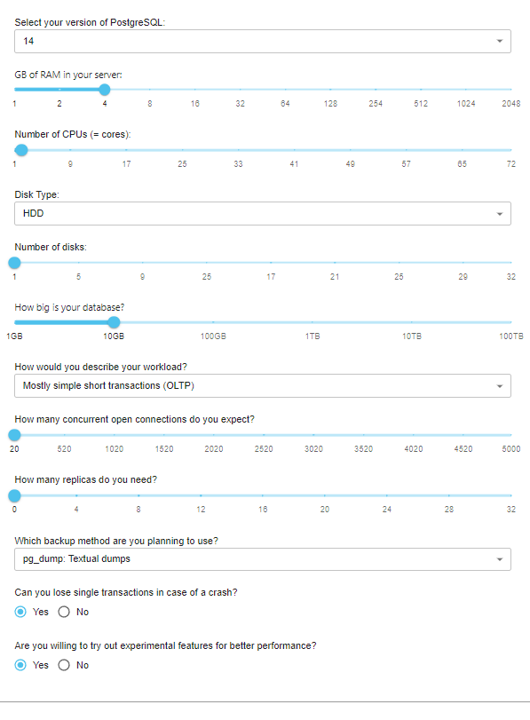

# Домашняя работа: Нагрузочное тестирование и тюнинг PostgreSQL
## Выполнение

1. *развернуть виртуальную машину любым удобным способом*

Создал виртуальную машину
    

2. *поставить на неё PostgreSQL 15 любым способом*

Установил postgresql через apt
```console
otus@otus:~$ sudo apt install postgresql
```

3. *настроить кластер PostgreSQL 15 на максимальную производительность не обращая внимание на возможные проблемы с надежностью в случае аварийной перезагрузки виртуальной машины*
4. *нагрузить кластер через утилиту через утилиту pgbench (https://postgrespro.ru/docs/postgrespro/14/pgbench)*

Сперва попробуем провести тест без предварительных настроек

Проинициализируем pgbench
```console
otus@otus:~$ pgbench -i -U postgres postgres
Password:
dropping old tables...
NOTICE:  table "pgbench_accounts" does not exist, skipping
NOTICE:  table "pgbench_branches" does not exist, skipping
NOTICE:  table "pgbench_history" does not exist, skipping
NOTICE:  table "pgbench_tellers" does not exist, skipping
creating tables...
generating data (client-side)...
100000 of 100000 tuples (100%) done (elapsed 0.07 s, remaining 0.00 s)
vacuuming...
creating primary keys...
done in 0.94 s (drop tables 0.00 s, create tables 0.02 s, client-side generate 0.67 s, vacuum 0.08 s, primary keys 0.18 s).
otus@otus:~$
```

Запустим тест на 1 минуту
```console
otus@otus:~$ pgbench -c8 -P 10 -T 60 -U postgres postgres
Password:
pgbench (14.11 (Ubuntu 14.11-0ubuntu0.22.04.1))
starting vacuum...end.
progress: 10.0 s, 620.0 tps, lat 12.801 ms stddev 8.710
progress: 20.0 s, 698.3 tps, lat 11.461 ms stddev 6.489
progress: 30.0 s, 682.7 tps, lat 11.713 ms stddev 6.753
progress: 40.0 s, 619.2 tps, lat 12.924 ms stddev 13.058
progress: 50.0 s, 690.6 tps, lat 11.585 ms stddev 6.592
progress: 60.0 s, 636.9 tps, lat 12.557 ms stddev 7.321
transaction type: <builtin: TPC-B (sort of)>
scaling factor: 1
query mode: simple
number of clients: 8
number of threads: 1
duration: 60 s
number of transactions actually processed: 39485
latency average = 12.144 ms
latency stddev = 8.402 ms
initial connection time = 67.429 ms
tps = 658.680955 (without initial connection time)
```
Посмотрим рекомендуемые настройки для нашей конфигурации в pgconfigurator



Применим предложенные настройки

```console
# DISCLAIMER - Software and the resulting config files are provided AS IS - IN NO EVENT SHALL
# BE THE CREATOR LIABLE TO ANY PARTY FOR DIRECT, INDIRECT, SPECIAL, INCIDENTAL, OR CONSEQUENTIAL
# DAMAGES, INCLUDING LOST PROFITS, ARISING OUT OF THE USE OF THIS SOFTWARE AND ITS DOCUMENTATION.

# Connectivity
max_connections = 20
superuser_reserved_connections = 3

# Memory Settings
shared_buffers = '1024 MB'
work_mem = '32 MB'
maintenance_work_mem = '320 MB'
huge_pages = off
effective_cache_size = '3 GB'
effective_io_concurrency = 1 # concurrent IO only really activated if OS supports posix_fadvise function
random_page_cost = 4 # speed of random disk access relative to sequential access (1.0)

# Monitoring
shared_preload_libraries = 'pg_stat_statements' # per statement resource usage stats
track_io_timing=on # measure exact block IO times
track_functions=pl # track execution times of pl-language procedures if any

# Replication
wal_level = replica # consider using at least 'replica'
max_wal_senders = 0
synchronous_commit = off

# Checkpointing:
checkpoint_timeout = '15 min'
checkpoint_completion_target = 0.9
max_wal_size = '1024 MB'
min_wal_size = '512 MB'


# WAL writing
wal_compression = on
wal_buffers = -1 # auto-tuned by Postgres till maximum of segment size (16MB by default)


# Background writer
bgwriter_delay = 200ms
bgwriter_lru_maxpages = 100
bgwriter_lru_multiplier = 2.0
bgwriter_flush_after = 0

# Parallel queries:
max_worker_processes = 2
max_parallel_workers_per_gather = 1
max_parallel_maintenance_workers = 1
max_parallel_workers = 2
parallel_leader_participation = on

# Advanced features
enable_partitionwise_join = on
enable_partitionwise_aggregate = on
jit = on
max_slot_wal_keep_size = '1000 MB'
track_wal_io_timing = on


# General notes:
# Note that not all settings are automatically tuned.
# Consider contacting experts at
# https://www.cybertec-postgresql.com
# for more professional expertise.
```

Перезапустим кластер, чтобы убедиться, что настройки применились успешно

```console
otus@otus:~$ sudo pg_ctlcluster 14 main restart
otus@otus:~$
```

Запустим тест ещё раз

```console
otus@otus:~$ pgbench -c8 -P 10 -T 60 -U postgres postgres
Password:
pgbench (14.11 (Ubuntu 14.11-0ubuntu0.22.04.1))
starting vacuum...end.
progress: 10.0 s, 2880.7 tps, lat 2.757 ms stddev 0.824
progress: 20.0 s, 2938.5 tps, lat 2.722 ms stddev 0.738
progress: 30.0 s, 2927.1 tps, lat 2.733 ms stddev 0.747
progress: 40.0 s, 2936.6 tps, lat 2.724 ms stddev 0.759
progress: 50.0 s, 2926.5 tps, lat 2.733 ms stddev 0.846
progress: 60.0 s, 2989.7 tps, lat 2.675 ms stddev 0.723
transaction type: <builtin: TPC-B (sort of)>
scaling factor: 1
query mode: simple
number of clients: 8
number of threads: 1
duration: 60 s
number of transactions actually processed: 175999
latency average = 2.724 ms
latency stddev = 0.777 ms
initial connection time = 69.963 ms
tps = 2935.761716 (without initial connection time)
```

tps 2935

Попробуем увеличить shared_buffers до 2GB, опустим wal_level до minimal, увеличим wal_writer_delay до 10000, чтобы реже писать логи на диск, поставим fsync = off, чтобы не скидывать логи на диск, отключим wal_compression, чтобы не сжимать wal.

```console
otus@otus:~$ pgbench -c8 -P 10 -T 60 -U postgres postgres
Password:
pgbench (14.11 (Ubuntu 14.11-0ubuntu0.22.04.1))
starting vacuum...end.
progress: 10.0 s, 2895.8 tps, lat 2.743 ms stddev 0.763
progress: 20.0 s, 2894.9 tps, lat 2.763 ms stddev 0.757
progress: 30.0 s, 2998.2 tps, lat 2.668 ms stddev 0.719
progress: 40.0 s, 3084.2 tps, lat 2.593 ms stddev 0.682
progress: 50.0 s, 2970.2 tps, lat 2.693 ms stddev 0.871
progress: 60.0 s, 3044.5 tps, lat 2.627 ms stddev 0.736
transaction type: <builtin: TPC-B (sort of)>
scaling factor: 1
query mode: simple
number of clients: 8
number of threads: 1
duration: 60 s
number of transactions actually processed: 178886
latency average = 2.680 ms
latency stddev = 0.761 ms
initial connection time = 67.987 ms
tps = 2984.042232 (without initial connection time)
```

Получили увеличение tps в пределах погрешности.

Пойдём на крайние меры, отключим autovacuum.

```console
otus@otus:~$ pgbench -c8 -P 10 -T 60 -U postgres postgres
Password:
pgbench (14.11 (Ubuntu 14.11-0ubuntu0.22.04.1))
starting vacuum...end.
progress: 10.0 s, 2903.8 tps, lat 2.735 ms stddev 0.783
progress: 20.0 s, 2991.7 tps, lat 2.674 ms stddev 0.750
progress: 30.0 s, 3002.6 tps, lat 2.664 ms stddev 0.724
progress: 40.0 s, 3092.2 tps, lat 2.587 ms stddev 0.687
progress: 50.0 s, 3053.3 tps, lat 2.620 ms stddev 0.704
progress: 60.0 s, 3016.4 tps, lat 2.652 ms stddev 0.718
transaction type: <builtin: TPC-B (sort of)>
scaling factor: 1
query mode: simple
number of clients: 8
number of threads: 1
duration: 60 s
number of transactions actually processed: 180608
latency average = 2.654 ms
latency stddev = 0.731 ms
initial connection time = 68.169 ms
tps = 3012.779055 (without initial connection time)
```

Получили микроскопическое увеличении tps, которое явно не стоит того, чтобы отключать autovacuum.