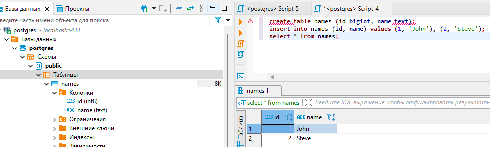
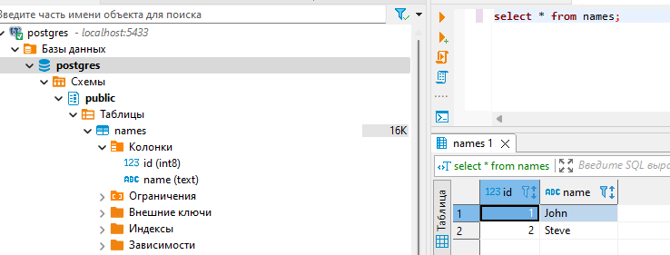

# Домашняя работа 2: Установка PostgreSQL

## Описание/Пошаговая инструкция выполнения домашнего задания:

* Создать ВМ с Ubuntu 20.04/22.04 или развернуть докер любым удобным способом
* Поставить на нем Docker Engine
сделать каталог /var/lib/postgres
* Развернуть контейнер с PostgreSQL 15 смонтировав в него /var/lib/postgresql
* Развернуть контейнер с клиентом postgres
* Подключится из контейнера с клиентом к контейнеру с сервером и сделать таблицу с парой строк
* Подключится к контейнеру с сервером с ноутбука/компьютера извне инстансов GCP/ЯО/места установки докера
* Удалить контейнер с сервером
* Создать его заново
* Подключится снова из контейнера с клиентом к контейнеру с сервером
* Проверить, что данные остались на месте

## Выполнение

Задание выполнялось в операционной системе **Microsoft Windows 11**

* Был скачан, установлен и запушен **Docker Desktop**
* В дирректории G:\otus был сохранён файл docker-compose.yaml

```yaml
version: '3.1'

volumes:
  pg_project:

services:
  pg_db:
    image: postgres:14
    restart: always
    environment:
      - POSTGRES_PASSWORD=postgres
      - POSTGRES_USER=postgres
      - POSTGRES_DB=stage
    volumes:
      - pg_project:/var/lib/postgresql/data
    ports:
      - ${POSTGRES_PORT:-5433}:5432
```

* Через cmd в этой дирректории была выполнена команда *docker-compose up*


*Результат выполнения docker compose up:*
```console
PS G:\otus> docker compose up
[+] Running 1/0
 ✔ Container otus-pg_db-1  Created                                                                                                                                             0.1s
Attaching to pg_db-1
pg_db-1  |
pg_db-1  | PostgreSQL Database directory appears to contain a database; Skipping initialization
pg_db-1  |
pg_db-1  | 2024-02-23 18:06:35.539 UTC [1] LOG:  starting PostgreSQL 14.11 (Debian 14.11-1.pgdg120+2) on x86_64-pc-linux-gnu, compiled by gcc (Debian 12.2.0-14) 12.2.0, 64-bit
pg_db-1  | 2024-02-23 18:06:35.540 UTC [1] LOG:  listening on IPv4 address "0.0.0.0", port 5432
pg_db-1  | 2024-02-23 18:06:35.540 UTC [1] LOG:  listening on IPv6 address "::", port 5432
pg_db-1  | 2024-02-23 18:06:35.545 UTC [1] LOG:  listening on Unix socket "/var/run/postgresql/.s.PGSQL.5432"
pg_db-1  | 2024-02-23 18:06:35.551 UTC [27] LOG:  database system was shut down at 2024-02-23 13:42:38 UTC
pg_db-1  | 2024-02-23 18:06:35.558 UTC [1] LOG:  database system is ready to accept connections
pg_db-1  | 2024-02-23 18:07:26.162 UTC [37] ERROR:  table "public" does not exist
pg_db-1  | 2024-02-23 18:07:26.162 UTC [37] STATEMENT:  drop table public
pg_db-1  | 2024-02-23 18:10:13.125 UTC [37] ERROR:  relation "names" already exists
pg_db-1  | 2024-02-23 18:10:13.125 UTC [37] STATEMENT:  create table names (id bigint, name text)
```

* Был скачан, установлен и запущен **DBeaver**
* Был осуществено подключение в базе данных через **DBeaver**:
    * Хост: localhost
    * Порт: 5433
    * База данных: postgres
    * Пользователь: postgres
    * Пароль: postgres

    *Подключение к базе данных:*

    


* Выполнены следующие команды:

```sql
create table names (id bigint, name text);
insert into names (id, name) values (1, 'John'), (2, 'Steve');
select * from names;
```

*Результат выполнения запросов:*



* Через ctrl+c остановил контейнер

```console
Gracefully stopping... (press Ctrl+C again to force)
[+] Stopping 1/1
 ✔ Container otus-pg_db-1  Stopped                                                                                                                                             0.3s
canceled
PS G:\otus>
```

* Удалил контейнер

```console
PS G:\otus> docker container remove otus-pg_db-1
otus-pg_db-1
PS G:\otus>
```


* Через cmd в этой дирректории была выполнена команда *docker-compose up*

```console
PS G:\otus> docker compose up
[+] Running 1/0
 ✔ Container otus-pg_db-1  Created                                                                                                                                             0.1s
Attaching to pg_db-1
pg_db-1  |
pg_db-1  | PostgreSQL Database directory appears to contain a database; Skipping initialization
pg_db-1  |
pg_db-1  | 2024-02-23 18:21:44.996 UTC [1] LOG:  starting PostgreSQL 14.11 (Debian 14.11-1.pgdg120+2) on x86_64-pc-linux-gnu, compiled by gcc (Debian 12.2.0-14) 12.2.0, 64-bit
pg_db-1  | 2024-02-23 18:21:44.996 UTC [1] LOG:  listening on IPv4 address "0.0.0.0", port 5432
pg_db-1  | 2024-02-23 18:21:44.996 UTC [1] LOG:  listening on IPv6 address "::", port 5432
pg_db-1  | 2024-02-23 18:21:45.003 UTC [1] LOG:  listening on Unix socket "/var/run/postgresql/.s.PGSQL.5432"
pg_db-1  | 2024-02-23 18:21:45.008 UTC [27] LOG:  database system was shut down at 2024-02-23 18:20:31 UTC
pg_db-1  | 2024-02-23 18:21:45.015 UTC [1] LOG:  database system is ready to accept connections
```


* В **DBeaver** была выполнена команда:

```sql
select * from names;
```

*Результат выполнения запроса:*

