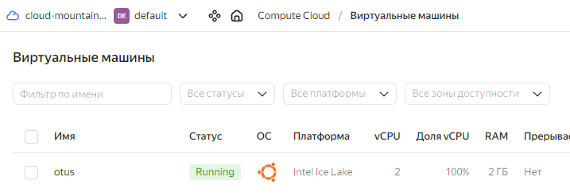
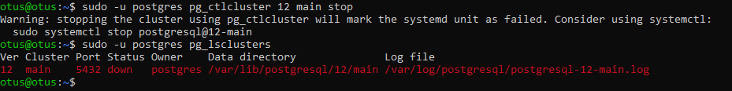
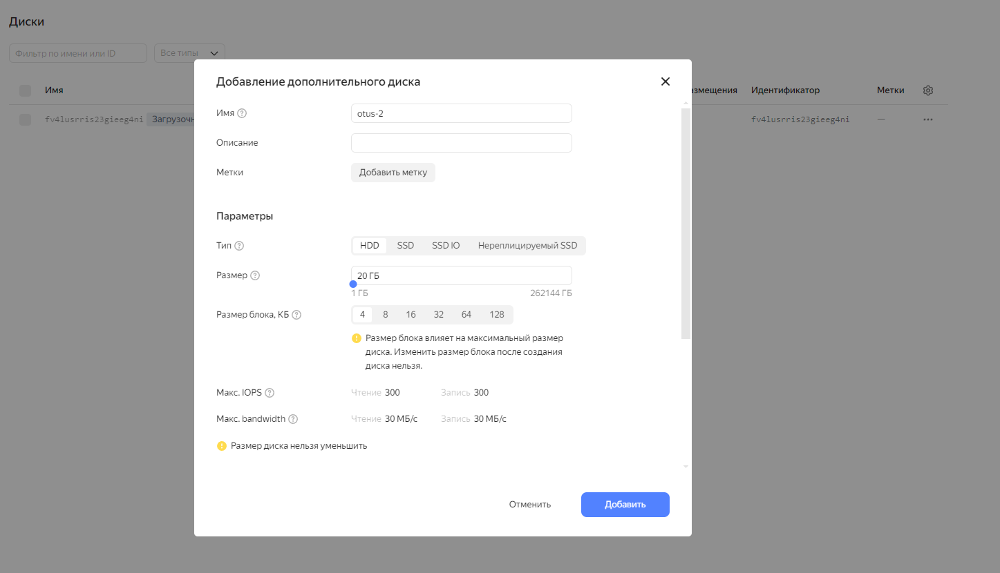
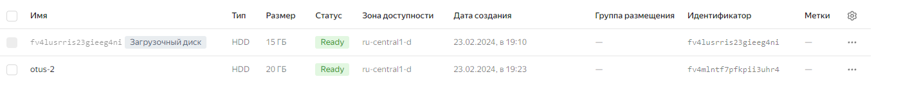
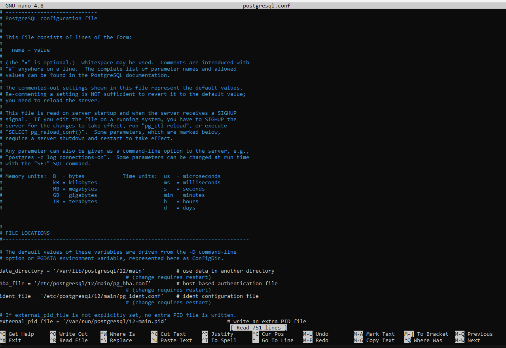
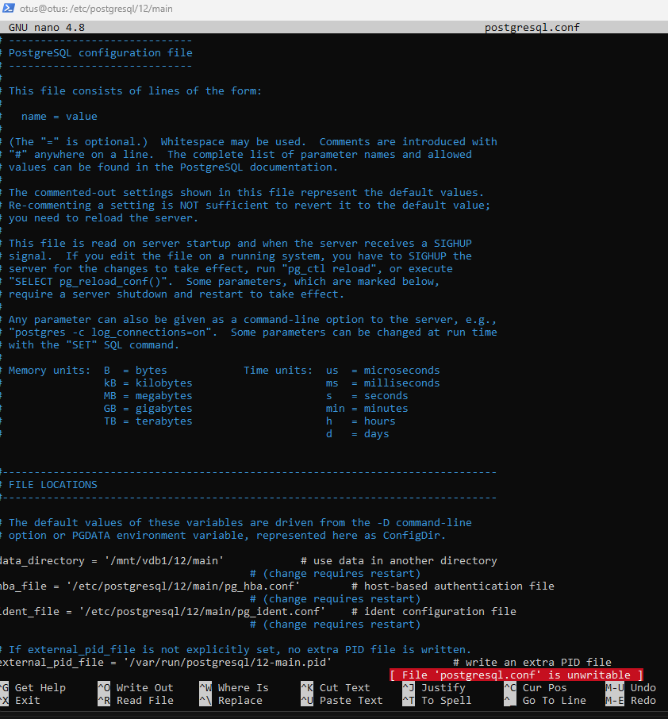

# Домашняя работа: Физический уровень PostgreSQL
## Выполнение

1. *создайте виртуальную машину c Ubuntu 20.04/22.04 LTS в GCE/ЯО/Virtual Box/докере*



Виртуальная машина создана

2. *поставьте на нее PostgreSQL 15 через sudo apt*

```console
otus@otus:~$ sudo apt install postgresql
```

3. *проверьте что кластер запущен через sudo -u postgres pg_lsclusters*


```console
otus@otus:~$ sudo -u postgres pg_lsclusters
Ver Cluster Port Status Owner    Data directory              Log file
12  main    5432 online postgres /var/lib/postgresql/12/main /var/log/postgresql/postgresql-12-main.log
```

4. *зайдите из под пользователя postgres в psql и сделайте произвольную таблицу с произвольным содержимым...*

```console
otus@otus:~$ sudo -u postgres psql
psql (12.17 (Ubuntu 12.17-0ubuntu0.20.04.1))
Type "help" for help.

postgres=#  create table test(c1 text);
CREATE TABLE
postgres=# insert into test values('1');
INSERT 0 1
postgres=# select c1 from test;
 c1
----
 1
(1 row)

postgres=# \q
```

5. *остановите postgres...*



6. *создайте новый диск к ВМ размером 10GB...*


Создание нового диска


Диск создан

Выполнение lsblk после создания диска

```console1
otus@otus:~$ sudo lsblk -o NAME,FSTYPE,SIZE,MOUNTPOINT,LABEL
NAME   FSTYPE SIZE MOUNTPOINT LABEL
vda            15G
├─vda1          1M
└─vda2 ext4    15G /
vdb            20G
```

7. *проинициализируйте диск согласно инструкции и подмонтировать файловую систему*

Создадим разделы с помощью fdisk

```console1
otus@otus:~$ sudo fdisk /dev/vdb

Welcome to fdisk (util-linux 2.34).
Changes will remain in memory only, until you decide to write them.
Be careful before using the write command.

Device does not contain a recognized partition table.
Created a new DOS disklabel with disk identifier 0x4e2ee90b.

Command (m for help): n
Partition type
   p   primary (0 primary, 0 extended, 4 free)
   e   extended (container for logical partitions)
Select (default p): p
Partition number (1-4, default 1):
First sector (2048-41943039, default 2048):
Last sector, +/-sectors or +/-size{K,M,G,T,P} (2048-41943039, default 41943039):

Created a new partition 1 of type 'Linux' and of size 20 GiB.

Command (m for help): p
Disk /dev/vdb: 20 GiB, 21474836480 bytes, 41943040 sectors
Units: sectors of 1 * 512 = 512 bytes
Sector size (logical/physical): 512 bytes / 4096 bytes
I/O size (minimum/optimal): 4096 bytes / 4096 bytes
Disklabel type: dos
Disk identifier: 0x4e2ee90b

Device     Boot Start      End  Sectors Size Id Type
/dev/vdb1        2048 41943039 41940992  20G 83 Linux

Command (m for help): w
The partition table has been altered.
Calling ioctl() to re-read partition table.
Syncing disks.
```

Отформатируем диск

```console
otus@otus:~$ sudo mkfs.ext4 /dev/vdb1
mke2fs 1.45.5 (07-Jan-2020)
Creating filesystem with 5242624 4k blocks and 1310720 inodes
Filesystem UUID: 950df3f8-2adf-4c4d-a01f-bcdd69e59ff2
Superblock backups stored on blocks:
        32768, 98304, 163840, 229376, 294912, 819200, 884736, 1605632, 2654208,
        4096000

Allocating group tables: done
Writing inode tables: done
Creating journal (32768 blocks): done
Writing superblocks and filesystem accounting information: done

otus@otus:~$
```

Смонтируем диск в дирректорию

```console
otus@otus:~$ sudo mkdir /mnt/vdb1
otus@otus:~$ sudo mount /dev/vdb1 /mnt/vdb1
```

8. *сделайте пользователя postgres владельцем*

```console
otus@otus:~$ sudo chown -R postgres:postgres /mnt/vdb1/
```

9. *перенесите содержимое*

```console
otus@otus:~$ sudo su postgres
postgres@otus:/home/otus$  mv /var/lib/postgresql/12 /mnt/vdb1
```

10 . *попытаться запустить*

```console
postgres@otus:/home/otus$ pg_ctlcluster 12 main start
Error: /var/lib/postgresql/12/main is not accessible or does not exist
```
Запустить не получилось так как не найдены файлы базы данных


11. *задание: найти конфигурационный параметр в файлах раположенных в /etc/postgresql/15/main который надо поменять и поменяйте его*

Поиск содержимого дирректории /etc/postgresql/12/main

```console
postgres@otus:/etc/postgresql/12/main$ ls
conf.d  environment  pg_ctl.conf  pg_hba.conf  pg_ident.conf  postgresql.conf  start.conf
```

Обнаружил, что в файле postgresql.conf есть параметр data_directory, в котором указан путь к ранее перенесёныным файлам



Поменял значение data_directory на /mnt/vdb1/12/main, чтобы теперь postgresql знал, где лежат файлы баз данных



Попробовал поднять postgresql

```console
otus@otus:~$ sudo systemctl start postgresql@12-main
```

Кластер поднялся

```console
otus@otus:~$ sudo -u postgres pg_lsclusters
Ver Cluster Port Status Owner    Data directory    Log file
12  main    5432 online postgres /mnt/vdb1/12/main /var/log/postgresql/postgresql-12-main.log
```

Попробовал получить данные

```console
otus@otus:~$ sudo -u postgres psql
psql (12.17 (Ubuntu 12.17-0ubuntu0.20.04.1))
Type "help" for help.

postgres=# select c1 from test;
 c1
----
 1
(1 row)

postgres=#
```

Удалось успешно запросить ранее вставленные данные
